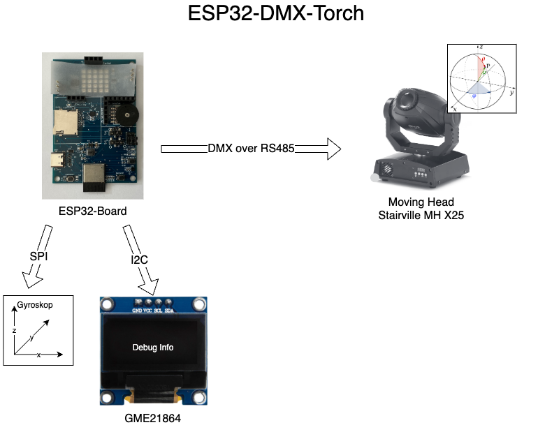

# ESP32 DMX Torch

This project enables intuitive control of a DMX moving head using an ESP32. By processing gyroscope data, the microcontroller translates physical movement into real-time lighting commands.

It is being developed as part of the **Embedded Systems** course at the **University of Applied Sciences Vorarlberg (FH Vorarlberg)**.

## Big Picture

## Concept

The ESP32 acts as an interactive controller, making the moving head behave like a **virtual flashlight**. Rotation and orientation are used to direct the beam, while specific gestures can be mapped to adjust color or brightness dynamically.

## Technical Interfaces

* DMX / RS485: Communication protocol for lighting fixtures.
* SPI: Interface for the gyroscope sensor to capture spatial orientation.
* I2C: Connection for an external display to show status and menu options.

## Concrete Hardware

* ESP32-C3 Board (see [Book Homepage](https://ritschel.at/das-board-speziell-zum-buch/))
  * includes a 5x5 WS2812b LED Matrix
* Stairville MH-X25 Moving Head (see [PDF](docs/stairville-mh-x25-manual.pdf))
* GME12864-11 OLED Screen (see [PDF](docs/GME12864-11%201.pdf))

## Important

* When using the ESP32-C3 book-development-board, ensure you have the Jumper at J1 at the right place to enable Acceleartor-Chip-Select!